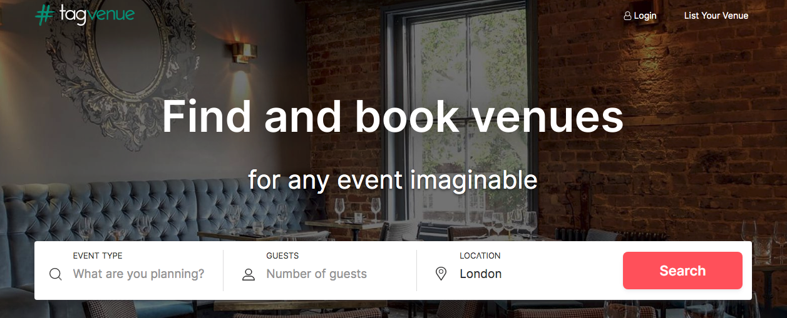

# Tagvenue ML Pricing Prediction

The [Tagvenue](https://www.tagvenue.com/) website is basically an Air BnB for finding and booking venues for an event. The website hosts thousands of venues in the UK that can be booked for events such as weddings, work drinks, birthdays etc. Each venue has one or more **spaces** available to be booked.

In this project, we have scraped all **London** event spaces from the Tagvenue website. We plan to clean and model this data to predict the price of event spaces in London using predictors such as capacity, area, location, facilities, licences etc. This repository will be updated as we make progress. 

## Notebooks

- **Tag_Venue_Scrape.ipynb** - Performs web scrape of Tagvenue, extracting data from all event spaces in London and creates 2 datasets: *tag_venue_space_data.csv* and *tag_venue_space_prices.csv*
- **tag_data_clean.ipynb** - Cleans the raw scraped datasets, including dealing with null or missing values, identifying erroneous data and re-engneering variables as required to make them sensible for exploration and modelling.
- **price_data_exploration.ipynb** - Explores the relatively complicated price data in *tag_venue_space_prices.csv* to understand the prices and decide what prices we will actually model. Creates 3 separate datasets for modeling (each dataset is a subset of the *tag_venue_space_prices.csv* that has been merged with the associated data in *tag_venue_space_data.csv* and is thus ready for modeling): 
  - *min_spend_data.csv* - To model **Min. Spend** prices
  - *hire_fee_data.csv* - To model **Hire fee** prices
  - *all_hire_fee_and_min_spend_data.csv* - To test the impact of changing the price data used in either the **hire fee** or **min. spend** models according to the time period of the prices (e.g. 'Per morning' prices vs 'Per afternoon etc. see *price_data_exploration.ipynb* for more details)

## Datasets

At present, we have the raw scraped data and the cleaned version of this data. Each data set has the same naming convention and description, but are stored in different locations of this repo to indicate if they are clean or raw.

Each dataset consists of 2 csv files described below: 

- **tag_venue_space_data.csv**: Stores general information on each space, e.g. location, area, capacity, catering details, features etc. One row per event space. 
- **tag_venue_space_prices.csv**: Stores price data for each space. The price data is a bit complex, with prices shown for different days of the week and for different time periods e.g. per hour or per day. Each row is one price offering for a single space on a single day of the week. Each space will have many price offerings and thus each space will have many rows in the csv.

## Metadata - Cleaned Data
Below we show metadata for the cleaned **tag_venue_space_data.csv** and **tag_venue_space_prices.csv** files: 

### tag_venue_space_data.csv
Column|Data type|Description
:---|:---:|:---
space_url|string|url of event space's web page on Tagvenue.com. Can be used as unique key for each space. 
venue_url|string|url of the venue web page on Tagvenue.com. The venue owns the space i.e. the event space resides within the venue. This column can be used to map spaces to venues i.e. to identify which spaces belong to a single venue.  
venue_name|string|Name of venue. The venue owns the space, i.e. the space resides within the venue. 
space_name|string|Name of event space
latitude|float|Latitude of venue
longitude|float|Longitude of venue
address|string|Address of venue
nearest_tube_station|string|Nearest tube station to venue. 
tube_distance|int|Distance in feet from venue to nearest tube station. 
max_seated|int|Maximum seating capacity of event space
max_standing|int|Maximum standing capacity of event space
max_seated_or_standing|int|The larger of max_seated and max_standing
min_area_per_person|float|The area per person assuming that the maximim number of guests are there. This is area_in_m2 divided by max_seated_or_standing. 
area_in_m2|int|Area of event space in metres squared
standing|bool|Indicates if the event space can provide a standing layout (True/False). 
dining|bool|Indicates if the event space can provide a dining layout (True/False). 
theatre|bool|Indicates if the event space can provide a theatre layout (True/False). 
boardroom|bool|Indicates if the event space can provide a boardroom layout (True/False). 
classroom|bool|Indicates if the event space can provide a classroom layout (True/False). 
cabaret|bool|Indicates if the event space can provide a cabaret layout (True/False). 
u_shaped|bool|Indicates if the event space can provide a u-shaped layout (True/False). 
Dining_max|int|Maximum capacity of space using a dining layout (will be 0 if dining layout is not available) 
Theatre_max|int|Maximum capacity of space using a theatre layout (will be 0 if theatre layout is not available) 
Boardroom_max|int|Maximum capacity of space using a boardroom layout (will be 0 if boardroom layout is not available) 
Classroom_max|int|Maximum capacity of space using a classroom layout (will be 0 if classroom layout is not available) 
Cabaret_max|int|Maximum capacity of space using a cabaret layout (will be 0 if cabaret layout is not available) 
U-Shaped_max|int|Maximum capacity of space using a u-shaped layout (will be 0 if u-shaped layout is not available) 
supervenue|bool|Is this venue a supervenue (True / False) - 'Supervenue program is based on our customers' feedback and highlights venues that are most dedicated to providing outstanding hospitality, customer service and event experience' 
external_catering|string|Categorical variable defining the external catering options for the venue. When any external caterer is allowed, the category will specify if a fee is required to use an external caterer and whether an in-house kitchen is available for guests to use to prepare food. It has the following categories:  'No External Catering', 'External Catering From Approved List', 'Any External Caterer - no fee - no kitchen for guests' , 'Any External Caterer - no fee - kitchen for guests', 'Any External Caterer - fee - no kitchen for guests' and 'Any External Caterer - fee - kitchen for guests'. 
in_house_kitchen|bool|The venue has an in-house kitchen to provide food (True/False)
byo_alcohol|string|Categorical column indicating whether the venue allows you to bring your own alcohol and if so, whether there is a corkage fee. Has the following categories: 'BYO alcohol not allowed',  'No Corkage fee' and 'Corkage Fee'. 
venue_provides_alcohol|bool|The venue provides alcohol (True/False)
alcohol_licence|string|The latest time the venue is allowed to sell alcohol. 
extension_available|string|Categorical variable indicating whether the alcohol licence can be extended to a later time. Has the values: 'extension available', 'extension not available', 'alcohol not available'.
complimentary_water|bool|Venue provides complimentary water (True/False)
complimentary_tea_and_coffee|bool|Venue provides complimentary tea and coffee (True/False)
Halal_menu|mixed string and bool|Indicates whether venue provides a Halal menu either through their in-house kitchen or from their approved external vendors. Has values: 'False', 'True', 'venue doesnt provide catering'. 
Kosher_menu|mixed string and bool|Indicates whether venue provides a kosher menu either through their in-house kitchen or from their approved external vendors. Has values: 'False', 'True', 'venue doesnt provide catering'. 
vegan_menu|mixed string and bool|Indicates whether venue provides a vegan menu either through their in-house kitchen or from their approved external vendors. Has values: 'False', 'True', 'venue doesnt provide catering'. 
gluten_free_menu|mixed string and bool|Indicates whether venue provides a gluten-free menu either through their in-house kitchen or from their approved external vendors. Has values: 'False', 'True', 'venue doesnt provide catering'. 
parking|string|Categorical variable of the parking options for the venue. Has the values: 'No Parking Available', 'Paid Parking', 'Free Parking', 'Paid and/or Free Parking ', 'Paid and Free Parking'
Wi-Fi|bool|Wifi is available in the space (True/False)
Projector|bool|A projector is available in the space (True/False)
Flipchart|bool|A flipchart is available in the space (True/False)
Natural_light|bool|Space has window and / or skylight that provides natural light (True/False).
Flatscreen_TV|bool|A flatscreen TV is available in the space (True/False)
Whiteboard|bool|A Whiteboard is available in the space (True/False)
Conference_call_facilities|bool|Conference call facilities are available in the space (True/False)
Air_conditioning|bool|Air conditionaing is available in the space (True/False)
Storage_space|bool|Storage space is available in the space to store items during an event (True/False)
Accommodation_available|bool|Accommodation is available in the venue (True/False)
Own_music_allowed|bool|Guests can play their own music in the space (True/False)
Bring_your_own_DJ|bool|Guests can bring their own DJ to the space (True/False)
PA_system_or_music_speakers_available|bool|A PA system or music speakers are available in the space (True/False)
Wheelchair_accessible|bool|The space is wheelchair accessible (True/False)
Promoted_or_ticketed_events|bool|The venue allows promoted or ticketed events (True/False)
Loud_music_or_events|bool|The venue allows events with amplified live or recorded music and / or loud entertainment (True/False).
Wedding_licence|bool|Venue is licenced to host wedding ceremonies and receptions (True/False).
Temporary_event_notices_(TENs)_available|bool|Temporary event notices (TENs) are available in the space, allowing you to carry out licensable events (such as weddings) in an unlicenced space (True/False)
Disabled_access_toilets|bool|Disabled access toilets are available in the space (True/False)
Ground_level|bool|The space is on ground level (True/False)
Lift_to_all_floors|bool|A lift to all floors is available in the venue (True/False).

### tag_venue_space_prices.csv
Column|Data type|Description
:---|:---:|:---
space_url|string|url of event space's web page on Tagvenue.com. Can be used as unique key for each space. 
venue_url|string|url of the venue web page on Tagvenue.com. The venue owns the space i.e. the event space resides within the venue. This column can be used to map spaces to venues i.e. to identify which spaces belong to a single venue.  
venue_name|string|Name of venue. The venue owns the space, i.e. the space resides within the venue. 
space_name|string|Name of event space
latitude|float|Latitude of venue
longitude|float|Longitude of venue
day_of_week|string|Day of week the price is for e.g. 'Monday' means this is the price to rent space on a Monday. 
time_period_desc|string|Description of time period that the price is for e.g. 'per morning' means you can hire the space at this price for a morning. 
time_period|string|A start and end time that precisely defines the time period that this price will hire the space for. It has the format 'start time - end time' and the times are written in integer format e.g. '6 - 17' means start time 6 am till end time 5 pm.
time_from|int|Start time of hire period, in 24 hour time format and stored as an integer. For example, 9.00 am is 9, 4 pm is 16 and 12 pm is 0.  
time_to|int|End time of hire period, in 24 hour time format and stored as an integer. For example, 9.00 am is 9, 4 pm is 16 and 12 pm is 0.  
time_length|int|Hours the space will be booked for at this price (difference in time between time_from and time_to). 
total_price|int|The total price in UK £s required to book the space on the day of week specified (in day_of_week) and for the time period specified (in time_period). 
price_type|string|Type of pricing e.g. 'min spend',  'hire fee' etc. or in the case of a combined price it could be 'min spend + hire'. The possible prices types are: 'hire fee', 'min. spend', 'per person', 'hire fee per hour', 'hire fee + min. spend', 'hire fee + per person'. 
rent_price_split|int|The amount of the total_price that is due to a hire fee (in UK £s). This will be null unless price_type is 'hire fee + min. spend' or 'hire fee + per person'. 
min_spend_split|int|The amount of the total_price that is due to a minimum spend (in UK £s). This will be null unless price_type is 'hire fee + min. spend' or 'hire fee + per person'. 
per_person_split|int|The amount of the total_price that is due to a per person fee (in UK £s). This will be null unless price_type is 'hire fee + min. spend' or 'hire fee + per person'.

## Metadata - Raw Scraped Data
Below we show metadata for the raw scraped **tag_venue_space_data.csv** and **tag_venue_space_prices.csv** files:

### tag_venue_space_data.csv
Column |Data type|Description
:---|:---:|:---
space_url|string|url of event space's web page on Tagvenue.com
venue_url|string|url of the venue web page on Tagvenue.com. The venue owns the space i.e. the event space resides within the venue. 
venue_name|string|Name of venue. The venue owns the space, i.e. the space resides within the venue. 
space_name |string|Name of event space
latitude|float|Latitude of venue
longitude|float|Longitude of venue
address|string|Address of venue
nearest_tube_station|string|Nearest tube station to venue, includes distance from nearest tube in feet when available 
max_seating|int|maximum seating capacity of event space
max_standing|int|maximum standing capacity of event space
area_in_msqrd|int|Area of event space in metres squared
catering_offered_by_venue|bool|Is catering offered by the venue for this event space (True / False)
external_catering_allowed|bool|Is external catering allowed for this event space (True/False)
supervenue|bool|Is this venue a supervenue (True / False) - 'Supervenue program is based on our customers' feedback and highlights venues that are most dedicated to providing outstanding hospitality, customer service and event experience' 
capacity section: columns 'Boardroom_max' to 'Classroom_max'|int|Each column header describes a different available layout e.g. 'Boardroom_max' is the boardroom layout. The value is the maximum capacity for the space when using that layout. The value will be missing if the space does not offer that layout. 
catering section part 1: columns 'Approved caterers only' to 'Venue provides alcohol'|int (1 or 0)|Each column header is a description of whether the venue does or does not provide a certain catering option. E.g. 'BYO alcohol not allowed' and 'BYO alcohol allowed'. These columns contain either a 1 or 0 to indicate which statement is correct for this venue. The pairs of contradicting statements are mutually exclusive such that if 'BYO alcohol not allowed' is 1 then 'BYO alcohol allowed' should be 0. The 'Approved Caterers Only' column has no contradicting column, i.e. there is no 'Unapproved Caterers Allowed' column. 
catering section part 2: columns 'Buyout fee for external catering' to 'Alcohol licence until 21:00'|bool|Each column header is a catering option (e.g. 'Halal menu') and the value will be True or False to indicate if the space offers that catering option.  If the value is missing, then the web page for the space did not indicate whether this catering option is available or not. 
features section: columns 'Wi-Fi' to 'Disabled access toilets'|bool|Each column header is a feature option (e.g. 'Wi-Fi') and the value will be True or False to indicate if the space offers that feature option.  If the value is missing, then the web page for the space did not indicate whether this feature option is available or not.

### tag_venue_space_prices.csv
Column |Data type|Description
:---|:---:|:---
space_url|string|url of the space web page on Tagvenue.com
venue_name|string|Name of venue
space_name |string|Name of event space
latitude|float|Latitude of venue
longitude|float|Longitude of venue
day_of_week|string|Day of week the price is for e.g. 'Monday' means this is the Monday price. 
pricing_period|string|Description of time period that that you can reserve the space for at this price e.g. 'per morning' 
time_period|string|Hours the space will be booked for at this price
price|string|Price in UK £s to book the space for the given day_of_week and pricing_period / time_period. This can be a combined price e.g. '£50 + £100' which is why it is a string datatype. The price_type column will indicate what each of the two prices quoted refer to. 
price_type|string|Type of pricing e.g. 'min spend',  'hire' etc. or in the case of a combined price it could be 'min spend + hire' 
